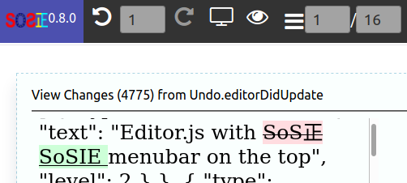

   

# View Plugin to view html and changes from exported blocks 

## Feature(s)

### View init helper

- Provides function to exports blocks as html
- Examine button to view colored diffs , handles BigBrother mode (New in 3.0.0)

### Sample button



When clicked, opens a html window with html rendering of the blocks 
the other de diff coloured.

## Integration

Add a line in  either your example.html, after the script-loader line in the loadPlugins section

```javascript
/**
* Plugins
*/
    await loadPlugins([
    {'sosie-js/script-loader@3.0.0': '[example/plugins/script-loader](https://github.com/sosie-js/script-loader)'}, //virtual , already loaded we keep a version trace here
    {'sosie-js/view-plugin@3.0.0': ['[example/plugins/view-plugin](https://github.com/sosie-js/view-plugin)',['dist/bundle.js','dist/sample.js']]}
],nocache,mode,target);
```

## Building the plugin

To produce the dist/bundle.js for production use the command: 

```shell
yarn build
```

## Missing something?

[A demo please SoSie](http://sosie.sos-productions.com/)
